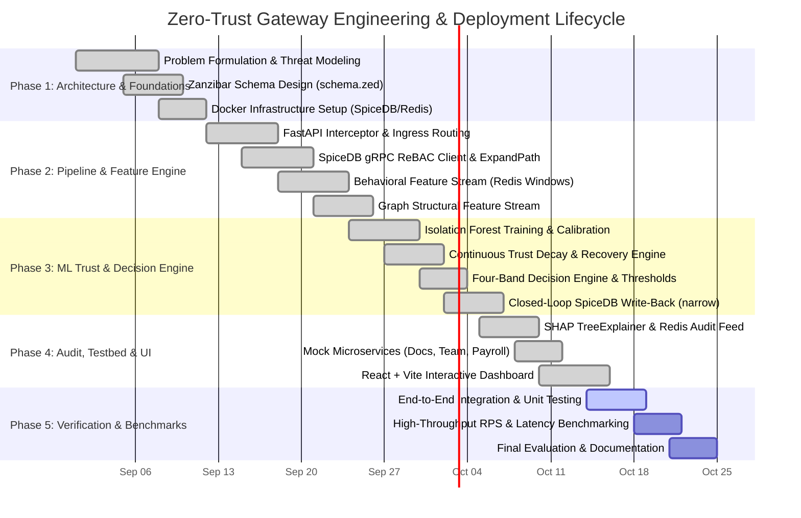
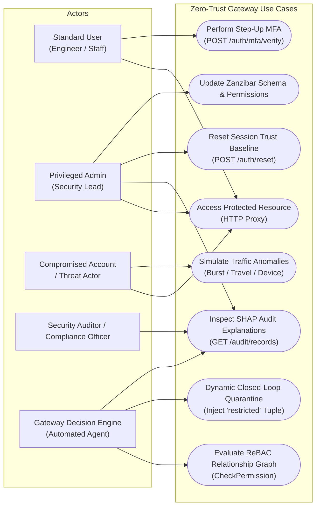
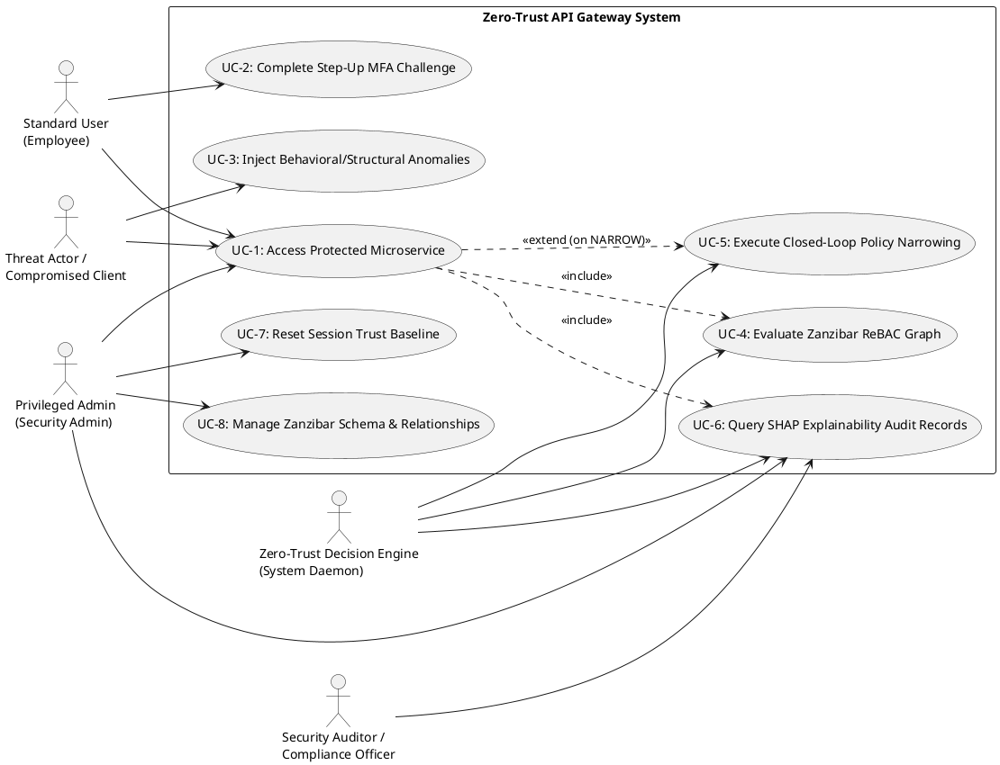
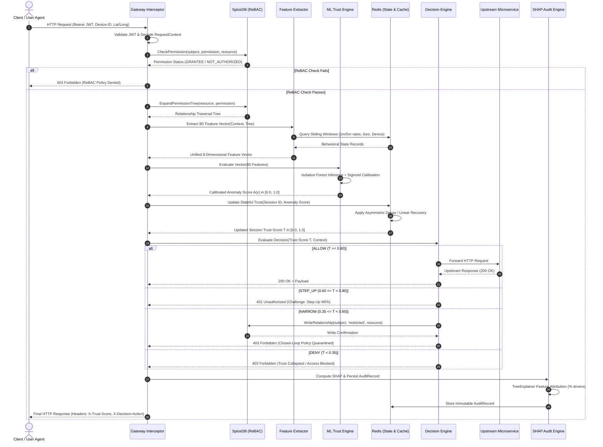
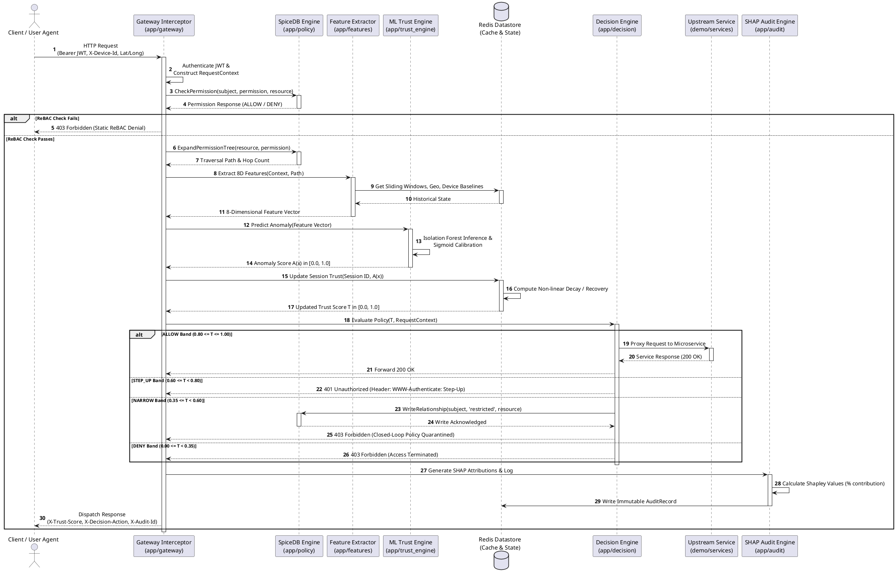

# Project Context & Comprehensive Technical Specification
## Graph-Aware Continuous Zero-Trust API Gateway

---

### 1. Background

Modern enterprise application landscapes have transitioned from monolithic, perimeter-defined systems to highly distributed microservice meshes deployed across hybrid and multi-cloud infrastructures. In these decentralized environments, traditional perimeter security models and coarse-grained role-based access control (RBAC) mechanisms are no longer sufficient. Static access tokens, such as JSON Web Tokens (JWT), operate on a binary "authenticate once, trust indefinitely" paradigm, leaving architectures critically vulnerable to session hijacking, lateral privilege escalation, and token theft. Concurrently, relationship-based access control (ReBAC)—pioneered by Google's Zanzibar model—has emerged as the gold standard for modeling complex, fine-grained organizational hierarchies and dynamic resource relationships. However, contemporary ReBAC deployments evaluate authorization policies statutorily, lacking real-time awareness of behavioral deviations or topological graph structural anomalies during user sessions. To establish a genuine Zero-Trust posture, modern API gateway architectures must continuously evaluate stateful session trust. This necessitates bridging fine-grained authorization graphs with real-time machine learning anomaly detection, dynamically restricting permissions in a closed-loop fashion before threat actors can exfiltrate sensitive enterprise resources.

---

### 2. Motivation

Enterprise cybersecurity faces severe challenges from compromised credentials, insider threats, and rapid lateral movement across internal microservices. Conventional defense tools, such as Security Information and Event Management (SIEM) platforms and Web Application Firewalls (WAF), suffer from acute limitations: they evaluate flat HTTP logs asynchronously, alerting security analysts hours after an incident has occurred rather than preventing active exfiltration. Furthermore, existing API gateways perform stateless, single-point-in-time checks, failing to retain risk context across consecutive user interactions. When anomalies occur, traditional systems either terminate sessions abruptly—harming productivity—or remain passive loggers. The motivation behind this project is to build an intelligent, graph-aware Zero-Trust API Gateway that replaces static binary permissions with continuous session trust scoring. By fusing behavioral telemetry with ReBAC graph traversal analysis, the gateway automatically executes closed-loop policy narrowing, restricting compromised privileges in real time while providing transparent SHAP-based mathematical explanations.

---

### 3. Scope

The scope of this project encompasses the end-to-end design, implementation, and empirical validation of an intelligent, graph-aware Zero-Trust API Gateway. In-scope deliverables include a high-performance reverse proxy interceptor built with FastAPI, gRPC integration with a SpiceDB ReBAC relationship engine enforcing Zanzibar-compliant schemas, and an in-memory Redis state manager for tracking rolling sliding-window behavioral features and session trust scores. The project incorporates an inline machine learning pipeline featuring a calibrated Isolation Forest model, an automated four-band decision engine supporting closed-loop policy narrowing write-backs, and a real-time SHAP explainability engine backed by an immutable Redis audit logging service. Additionally, the scope contains a containerized microservices testbed comprising three Node.js backend services and an interactive React-based simulation dashboard for real-time demonstration. Out of scope are hardware-level network appliances, Layer 3/4 packet filtering, public key infrastructure (PKI) certificate authority operations, static source code security scanning, and native mobile client SDK development, focusing strictly on Layer 7 API gateway authorization intelligence.

---

### 4. Objectives (SMART)

The project objectives are formulated according to the **SMART** (Specific, Measurable, Achievable, Relevant, and Time-bound) framework:

* **Specific:**
  * Design and implement a Layer-7 Zero-Trust API Gateway interceptor capable of extracting an 8-dimensional unified feature vector comprising 5 behavioral signals (request rates over 1m/5m, geo-velocity, device mismatch, time-of-day deviation) and 3 ReBAC graph-structural signals (traversal hop count, path novelty score, privilege shortcut flag).
  * Integrate an inline unsupervised Isolation Forest anomaly detection model calibrated via a sigmoid transfer function ($A(x) = \frac{1}{1 + e^{12 \cdot s(x)}}$) linked to a stateful trust engine in Redis with asymmetric non-linear decay and linear recovery.
  * Implement an automated closed-loop policy narrowing mechanism that dynamically injects transient `restricted` relation tuples into SpiceDB without human intervention when trust degrades into the quarantine band ($0.35 \le T < 0.60$).
  * Provide real-time explainability on all gateway decisions using SHAP (SHapley Additive exPlanations) `TreeExplainer` feature attributions persisted to an immutable Redis audit store.

* **Measurable:**
  * Maintain end-to-end inline gateway authorization and scoring latency under **$5\text{ ms}$** for standard evaluations (and under **$25\text{ ms}$** when executing inline SHAP feature attribution).
  * Achieve a sustained throughput of $\ge 2,500\text{ requests per second (RPS)}$ on commodity compute instances.
  * Reduce unauthorized lateral movement attempts and abnormal privilege escalations to zero ($0\%$) by enforcing fine-grained Zanzibar path validations and dynamic quarantine revocations.
  * Ensure $100\%$ of enforcement decisions (`ALLOW`, `STEP_UP`, `NARROW`, `DENY`) produce complete, auditable JSON telemetry with exact mathematical feature percentage weights.

* **Achievable:**
  * Build upon proven, industry-standard, high-performance technologies: Python 3.12, FastAPI ASGI, SpiceDB (Authzed Zanzibar engine via gRPC), Redis in-memory key-value store, scikit-learn, and SHAP.
  * Validate components through a modular testing suite with $\ge 90\%$ code coverage across unit, integration, and performance benchmark suites using `pytest` and synthetic load generators.

* **Relevant:**
  * Directly solves critical industry security challenges: credential compromise, session hijacking, God-admin over-privileging, and SIEM alert fatigue.
  * Aligns with the NIST SP 800-207 Zero Trust Architecture guidelines by enforcing continuous verification and dynamic least-privilege access.

* **Time-bound:**
  * Complete full system specification, schema modeling, core gateway pipeline, ML scoring engine, closed-loop feedback, explainability audit, and frontend testbed within an 8-week development and evaluation lifecycle.

---

### 5. Problem Statement

Modern microservice architectures rely heavily on static bearer tokens (e.g., JWT) evaluated at network boundaries through flat, role-based or attribute-based access control (RBAC/ABAC). This architecture suffers from four fundamental, critical flaws:

1. **Topological Blindness & Privilege Escalation:** Conventional gateways evaluate access requests purely on flat roles (e.g., `role: admin`), without visibility into the underlying relationship graph or traversal paths. They cannot detect whether a subject is accessing a sensitive resource via an anomalous graph shortcut or an unauthorized lateral bypass.
2. **Stateless, Point-in-Time Authorization:** Once issued, authentication tokens grant static, unrestricted access until expiration. Traditional gateways do not track continuous session state or cumulative risk, leaving systems defenseless against active session hijacking, device switching, or rapid geographical teleportation (impossible travel).
3. **Passive, Alert-Only Anomaly Detection:** Existing security solutions (SIEM, IDS/IPS, WAF) analyze logs out-of-band and generate passive alerts hours after exfiltration has begun. They lack closed-loop actuation mechanisms to dynamically tighten active authorization graphs in real time.
4. **Black-Box Enforcement & Lack of Explainability:** Security teams cannot readily interpret or defend automated AI access decisions, leading to user friction, false positives, and compliance violations without mathematical explainability.

**Core Challenge Addressed:** How can an API gateway continuously compute a real-time, stateful session trust score combining behavioral telemetry and graph-structural ReBAC paths, and use that score in a closed-loop feedback mechanism to dynamically mutate authorization graphs and throttle compromised sessions with sub-5ms latency and full mathematical explainability?

---

### 6. Gantt Chart UML Code

#### Mermaid Gantt Chart


#### PlantUML Gantt Chart
```plantuml
@startuml
title Zero-Trust Gateway Engineering & Deployment Lifecycle
[Problem Formulation & Threat Modeling] lasts 7 days
[Problem Formulation & Threat Modeling] starts 2026-09-01
[Zanzibar Schema Design (schema.zed)] lasts 5 days
[Zanzibar Schema Design (schema.zed)] starts 2026-09-05
[Docker Infrastructure Setup (SpiceDB/Redis)] lasts 4 days
[Docker Infrastructure Setup (SpiceDB/Redis)] starts 2026-09-08

[FastAPI Interceptor & Ingress Routing] lasts 6 days
[FastAPI Interceptor & Ingress Routing] starts 2026-09-12
[SpiceDB gRPC ReBAC Client & ExpandPath] lasts 6 days
[SpiceDB gRPC ReBAC Client & ExpandPath] starts 2026-09-15
[Behavioral Feature Stream (Redis Windows)] lasts 6 days
[Behavioral Feature Stream (Redis Windows)] starts 2026-09-18
[Graph Structural Feature Stream] lasts 5 days
[Graph Structural Feature Stream] starts 2026-09-21

[Isolation Forest Training & Calibration] lasts 6 days
[Isolation Forest Training & Calibration] starts 2026-09-24
[Continuous Trust Decay & Recovery Engine] lasts 5 days
[Continuous Trust Decay & Recovery Engine] starts 2026-09-27
[Four-Band Decision Engine & Thresholds] lasts 4 days
[Four-Band Decision Engine & Thresholds] starts 2026-09-30
[Closed-Loop SpiceDB Write-Back (narrow)] lasts 5 days
[Closed-Loop SpiceDB Write-Back (narrow)] starts 2026-10-02

[SHAP TreeExplainer & Redis Audit Feed] lasts 5 days
[SHAP TreeExplainer & Redis Audit Feed] starts 2026-10-05
[Mock Microservices (Docs, Team, Payroll)] lasts 4 days
[Mock Microservices (Docs, Team, Payroll)] starts 2026-10-08
[React + Vite Interactive Dashboard] lasts 6 days
[React + Vite Interactive Dashboard] starts 2026-10-10

[End-to-End Integration & Unit Testing] lasts 5 days
[End-to-End Integration & Unit Testing] starts 2026-10-14
[High-Throughput RPS & Latency Benchmarking] lasts 4 days
[High-Throughput RPS & Latency Benchmarking] starts 2026-10-18
[Final Evaluation & Documentation] lasts 4 days
[Final Evaluation & Documentation] starts 2026-10-21
@enduml
```

---

### 7. Technical Specifications

#### 7.1 Requirements

##### 7.1.1 Functional Requirements
* **FR-1: Request Ingress & JWT Authentication:** Intercept incoming HTTP requests, decode and validate JWT bearer tokens, extract subject identity, target resource, action verb, client IP, geographical coordinates, device hardware identifiers, and timestamps into an immutable `RequestContext`.
* **FR-2: ReBAC Policy Enforcement:** Evaluate permissions using Google Zanzibar semantics in SpiceDB over gRPC (`CheckPermission`). Enforce role hierarchy, team memberships, and negative restriction relations (`permission view = (reader + writer + owner) - restricted`).
* **FR-3: Dual-Stream Feature Extraction:** Generate an 8-dimensional feature vector in real time:
  * *Behavioral Stream:* Compute rolling 1-minute and 5-minute request frequencies via Redis sliding-window sorted sets, calculate Haversine geo-velocity (km/h) against previous coordinates, flag hardware device fingerprint mismatches, and quantify time-of-day deviation from standard business hours.
  * *Graph-Structural Stream:* Expand SpiceDB traversal trees (`ExpandPermissionTree`) to compute shortest path hop counts, calculate trajectory novelty scores against known session path signatures, and flag unauthorized direct privilege shortcuts.
* **FR-4: ML Anomaly Inference & Trust Dynamics:** Score the 8D vector using an unsupervised Isolation Forest model, calibrate raw decision function values into an anomaly probability $A(x) \in [0.0, 1.0]$, and update stateful session trust $T$ using asymmetric exponential decay on anomalies ($\Delta T = 1.0 \times (A - 0.45)^{1.2}$) and linear asymptotic recovery on benign requests ($\Delta T = 0.05 + 0.0001 \times \Delta t$).
* **FR-5: Multi-Band Decision & Closed-Loop Actuation:** Map trust score $T$ into four enforcement bands:
  * **`ALLOW` ($0.80 \le T \le 1.00$ / $200\text{ OK}$):** Forward request to upstream microservice.
  * **`STEP_UP` ($0.60 \le T < 0.80$ / $401\text{ Unauthorized}$):** Issue challenge `WWW-Authenticate: Step-Up` requiring multi-factor authentication.
  * **`NARROW` ($0.35 \le T < 0.60$ / $403\text{ Forbidden}$):** Write a temporary `restricted` relationship tuple into SpiceDB to immediately narrow access in the active authorization graph without admin intervention.
  * **`DENY` ($0.00 \le T < 0.35$ / $403\text{ Forbidden}$):** Immediately block request and invalidate session.
* **FR-6: Explainability & Immutable Audit Logging:** Run SHAP `TreeExplainer` on every anomaly evaluation to compute exact mathematical attribution percentages for all 8 features. Store structured `AuditRecord` objects in Redis and expose them via REST endpoints (`/audit/records`).
* **FR-7: Interactive Simulation Testbed:** Provide a responsive single-page application dashboard supporting persona switching, live trust meters, real-time SHAP feature contribution charts, anomaly injection buttons (rate burst, impossible travel, device spoofing), and MFA step-up verification.

##### 7.1.2 Non-Functional Requirements
* **NFR-1: Low Latency & High Performance:** Complete inline request processing (JWT validation + ReBAC check + feature extraction + ML scoring + Redis state update) in $< 5.0\text{ ms}$ average latency.
* **NFR-2: High Throughput & Scalability:** Sustain $\ge 2,500\text{ requests per second (RPS)}$ per gateway worker node under continuous load without resource starvation.
* **NFR-3: High Availability & Fault Tolerance:** Provide automatic fail-safe behavior with graceful fallback policies if external dependencies (e.g., SpiceDB or Redis) experience transient network partitions.
* **NFR-4: Cryptographic & Data Integrity:** Protect session states and JWT tokens with HMAC-SHA256 signatures; enforce structured Pydantic schema validation across all internal module boundaries.
* **NFR-5: Modularity & Separation of Concerns:** Decouple ingress, policy, feature engineering, trust scoring, decision making, and auditing into independent, clean Python modules testable in isolation.
* **NFR-6: Explainability & Compliance:** Ensure all access denials and step-up challenges produce deterministic, explainable mathematical feature attributions compliant with GDPR, SOC2, and ISO 27001 auditability standards.

---

#### 7.2 Feasibility Study

##### 7.2.1 Technical Feasibility
* **Core Technology Stack:** Python 3.12, FastAPI, SpiceDB (Authzed), Redis, scikit-learn, and SHAP provide a battle-tested foundation for high-performance distributed systems.
* **Algorithmic Complexity:**
  * SpiceDB relationship lookups execute in $O(\log V + E)$ over optimized indexed datastores.
  * Sliding-window rate calculations in Redis sorted sets execute in $O(\log N + M)$ where $N$ is total requests in window and $M$ is expired elements.
  * Isolation Forest evaluation over 100 shallow trees for an 8-dimensional vector runs in under $0.8\text{ ms}$ ($O(T \cdot D)$ where $T=100, D \le 8$).
  * Pre-trained SHAP `TreeExplainer` operates with optimized C/C++ extensions, allowing fast local attribution.
* **System Integration:** Fully containerized architecture using Docker Compose allows seamless local development, testing, and cloud deployment on Kubernetes.

##### 7.2.2 Economic Feasibility
* **Open-Source Infrastructure:** The entire solution is composed of open-source software (SpiceDB Open Source, Redis Community, FastAPI, scikit-learn, React, Vite), eliminating upfront proprietary licensing costs.
* **Low Hardware Footprint:** The lightweight microservices and async Python ASGI gateway operate efficiently on standard commodity virtual machines or serverless containers without requiring costly GPU clusters for ML inference.
* **Cost Avoidance:** Proactively mitigates data breach damages, ransomware lateral movement, and regulatory non-compliance fines by preventing unauthorized data exfiltration in real time.

##### 7.2.3 Social Feasibility
* **Ethical AI & Transparency:** Replacing black-box neural networks with explainable Isolation Forest and SHAP feature attributions ensures algorithmic transparency, preventing arbitrary or biased user lockouts.
* **User Experience & Reduced Friction:** Instead of forcing intrusive MFA on every single request, the system only challenges users when trust degrades below baseline thresholds (`STEP_UP`), preserving high usability.
* **Regulatory & Privacy Alignment:** Complies with modern enterprise governance standards (NIST SP 800-207 Zero Trust, HIPAA, GDPR Article 22 Right to Explanation) by providing transparent decision records and preserving data minimization.

---

#### 7.3 System Specifications (Software Only)

| Component / Layer | Software / Library | Version | Role / Purpose |
| :--- | :--- | :--- | :--- |
| **Runtime Environment** | Python | `3.12.x` | Core backend programming language |
| **Package Manager** | `uv` | `0.5.x+` | Fast Python package management and virtualenv orchestration |
| **API Gateway Framework** | FastAPI | `^0.115.0` | High-performance asynchronous Layer-7 HTTP reverse proxy |
| **ASGI Server** | Uvicorn | `^0.34.0` | Asynchronous server gateway interface for FastAPI |
| **Data Validation** | Pydantic / Pydantic Settings | `^2.10.0` | Strict data modeling, schema validation, and configuration loading |
| **ReBAC Authorization Store** | SpiceDB (Authzed) | `v1.30.0+` | Google Zanzibar-style relationship graph engine (gRPC) |
| **ReBAC Python Client** | `authzed` | `^1.25.0` | Official Python gRPC client for SpiceDB schema and permission checks |
| **In-Memory Cache & State Store**| Redis / `redis-py` | `7.x / ^5.2.0` | Sliding window rate limits, session trust cache, and audit store |
| **Machine Learning Engine** | scikit-learn | `^1.5.0` | Unsupervised Isolation Forest anomaly detection algorithm |
| **Explainability Engine** | SHAP | `^0.46.0` | TreeExplainer for calculating Shapley feature attribution values |
| **Numerical Processing** | NumPy / Numba | `^1.26.0 / ^0.60.0` | Vector mathematics and JIT acceleration for feature processing |
| **Authentication & Tokens** | PyJWT | `^2.8.0` | Cryptographic JWT decoding, token verification, and payload extraction |
| **Testing Framework** | pytest / pytest-asyncio | `^8.3.0 / ^0.25.0` | Unit, integration, and asynchronous pipeline testing |
| **Linting & Code Formatting** | Ruff | `^0.9.0` | Fast Python linter and formatter |
| **Static Type Checking** | mypy | `^1.14.0` | Strict static type verification |
| **Containerization** | Docker & Docker Compose | `v24.x+` | Container deployment for SpiceDB, Redis, and Gateway services |
| **Mock Backend Services** | Node.js / Express.js | `v20.x+ / 4.x` | Upstream microservices (Docs `:3001`, Team `:3002`, Payroll `:3003`)|
| **Frontend Framework** | React + TypeScript | `18.x` | Single-page application for live demonstration and visualization |
| **Frontend Build Tool** | Vite | `5.x` | Fast modern frontend tooling and local dev server (`:4000`) |

---

### 8. System Architecture & UML Design

#### 8.1 System Architecture in Words

The system is architected as a modular, defense-in-depth Layer-7 Zero-Trust API Gateway operating in front of enterprise microservices. The architecture is organized into seven decoupled, interacting layers:

1. **Ingress & Authentication Layer (`app/gateway/`):**
   Acts as the central entry point for all client requests. Incoming requests contain a JWT Bearer token and client telemetry headers (`X-Device-Id`, `X-Client-Latitude`, `X-Client-Longitude`). The gateway validates the cryptographic signature of the token and builds a strongly-typed `RequestContext` containing the subject, resource, action, and environment attributes.
2. **Policy & Relationship Graph Layer (`app/policy/`):**
   Communicates with a containerized SpiceDB engine over gRPC. It maintains Zanzibar relationship schemas (`schema.zed`) containing user, team, and document entities with negative-set relations (`restricted`). It validates base permissions (`CheckPermission`) and extracts relationship graph traversal paths (`ExpandPermissionTree`).
3. **Dual-Stream Feature Extraction Engine (`app/features/`):**
   Extracts an 8-dimensional numerical feature vector per request:
   * *Behavioral Stream (`behavioral.py`):* Queries Redis sliding-window sorted sets to determine 1-minute and 5-minute request rates, computes Haversine geo-velocity (km/h) between consecutive request coordinates, detects device fingerprint mismatches against session baselines, and quantifies time-of-day deviations from standard operating hours.
   * *Graph-Structural Stream (`graph.py`):* Inspects SpiceDB relationship paths to determine shortest path traversal hop counts, path novelty scores (frequency penalty for unseen graph trajectories), and privilege shortcut indicators.
4. **Trust & Anomaly Scoring Engine (`app/trust_engine/`):**
   Passes the 8D feature vector into a pre-trained scikit-learn Isolation Forest model. Raw anomaly scores are mapped via a calibrated sigmoid function to an anomaly probability $A(x) \in [0.0, 1.0]$. A Redis-backed state manager updates the session's continuous trust score ($0.0 \le T \le 1.0$) applying non-linear exponential decay when anomalous and gradual linear recovery when benign.
5. **Decision & Closed-Loop Feedback Engine (`app/decision/`):**
   Maps the continuous trust score to four operational bands:
   * `ALLOW` ($T \ge 0.80$): Requests are proxied to upstream microservices.
   * `STEP_UP` ($0.60 \le T < 0.80$): Prompts the client for step-up multi-factor authentication.
   * `NARROW` ($0.35 \le T < 0.60$): Dynamically injects a temporary `restricted` relationship tuple into SpiceDB, revoking elevated permissions in the live graph.
   * `DENY` ($T < 0.35$): Immediately blocks access and terminates session.
6. **Explainability & Immutable Audit Engine (`app/audit/`):**
   Executes SHAP `TreeExplainer` inference on anomalous evaluations to calculate feature attribution percentages, explaining exactly why trust degraded. An immutable `AuditRecord` is stored in Redis and published to the real-time audit feed.
7. **Downstream Microservices & UI Testbed (`demo/`):**
   A cluster of three Node.js backend services (`docs-service`, `team-service`, `payroll-service`) protected by the gateway, coupled with an interactive React + Vite web dashboard displaying real-time trust meters, anomaly simulation buttons, and live SHAP audit visualization.

---

#### 8.2 Design Data Flow Diagram (DFD) UML Code

##### Mermaid Data Flow Diagram (DFD Level 1)
```mermaid
flowchart TD
    subgraph External_Entities [External Entities]
        Client["Client / User Agent"]
        Upstream["Upstream Microservices\n(Docs, Team, Payroll)"]
    end

    subgraph Zero_Trust_Gateway [Zero-Trust API Gateway Boundary]
        P1["1.0 Authenticate & Ingest Context\n(JWT & Headers)"]
        P2["2.0 ReBAC Graph Check\n(CheckPermission)"]
        P3["3.0 Dual-Stream Feature Extraction\n(Behavioral + Graph)"]
        P4["4.0 ML Anomaly Scoring\n(Isolation Forest)"]
        P5["5.0 Continuous Trust State Management\n(Decay & Recovery)"]
        P6["6.0 Decision & Closed-Loop Actuation\n(ALLOW / STEP_UP / NARROW / DENY)"]
        P7["7.0 SHAP Attribution & Audit Logging\n(TreeExplainer)"]
    end

    subgraph Data_Stores [Data Stores]
        DB_SpiceDB[("SpiceDB Graph Store\n(Relationships & Restrictions)")]
        DB_Redis[("Redis In-Memory Store\n(Sliding Windows, Trust State, Audit Log)")]
    end

    %% Flow connections
    Client -->|1. HTTP Request + JWT + Telemetry| P1
    P1 -->|2. Context: Subject, Resource, Action| P2
    P2 <-->|3. gRPC Permission & Expand Tree Query| DB_SpiceDB
    
    P2 -->|4. Validated Context & Path Data| P3
    P3 <-->|5. Read/Write Request History & Baselines| DB_Redis
    
    P3 -->|6. 8D Feature Vector| P4
    P4 -->|7. Calibrated Anomaly Score A| P5
    P5 <-->|8. Read/Update Session Trust Score T| DB_Redis
    
    P5 -->|9. Final Trust Score & Context| P6
    P6 -->|10a. Closed-Loop: Write 'restricted' Tuple| DB_SpiceDB
    P6 -->|10b. Proxy Request (ALLOW)| Upstream
    Upstream -->|11. Upstream Response| P6
    P6 -->|12. Final HTTP Response (200/401/403)| Client

    P6 -->|13. Decision & Vector Data| P7
    P7 -->|14. Immutable Audit Record & SHAP Attribution| DB_Redis
```

##### PlantUML Data Flow Diagram (DFD)

```plantuml
@startuml
!theme plain
skinparam roundcorner 10
skinparam defaultFontName Arial

actor "Client / User Agent" as Client
component "Upstream Microservices\n(Docs, Team, Payroll)" as Upstream

package "Zero-Trust API Gateway" {
    rectangle "1.0 Authenticate & Ingest Context" as P1
    rectangle "2.0 ReBAC Graph Check" as P2
    rectangle "3.0 Dual-Stream Feature Extraction" as P3
    rectangle "4.0 ML Anomaly Scoring (Isolation Forest)" as P4
    rectangle "5.0 Continuous Trust State Manager" as P5
    rectangle "6.0 Decision & Closed-Loop Actuation" as P6
    rectangle "7.0 SHAP Attribution & Audit Logging" as P7
}

database "SpiceDB Engine\n(Relationship Graph)" as SpiceDB
database "Redis Datastore\n(Sliding Windows, Trust, Audit)" as Redis

Client -> P1 : HTTP Request (JWT + Telemetry)
P1 -> P2 : RequestContext
P2 <--> SpiceDB : gRPC CheckPermission / ExpandPath
P2 -> P3 : Graph Path & Context
P3 <--> Redis : Sliding Window & Geo History
P3 -> P4 : 8-Dimensional Feature Vector
P4 -> P5 : Calibrated Anomaly Score A(x)
P5 <--> Redis : State Read/Write (Trust Score T)
P5 -> P6 : Trust Score & Decision Request

P6 --> SpiceDB : Closed-Loop: Inject 'restricted' Tuple (NARROW)
P6 --> Upstream : Proxy Authorized Request (ALLOW)
Upstream --> P6 : Service Response
P6 --> Client : HTTP Response (200 / 401 / 403)

P6 -> P7 : Trigger Audit Evaluation
P7 -> Redis : Store Immutable AuditRecord with SHAP Drivers

@enduml
```


---

#### 8.3 Use Case Diagram UML Code

##### Mermaid Use Case Diagram


##### PlantUML Use Case Diagram


---

#### 8.4 Sequence Diagram UML Code

##### Mermaid Sequence Diagram (End-to-End Request Evaluation)


##### PlantUML Sequence Diagram (End-to-End Request Lifecycle)


---
